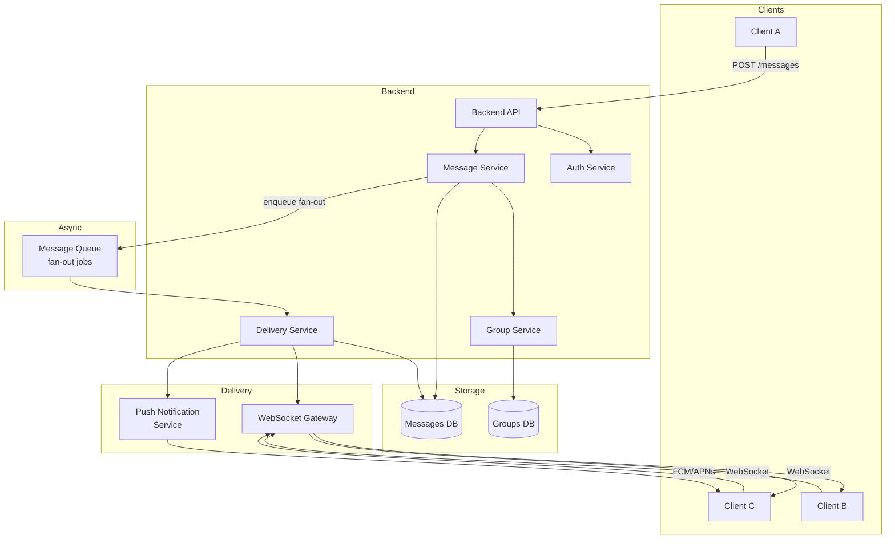
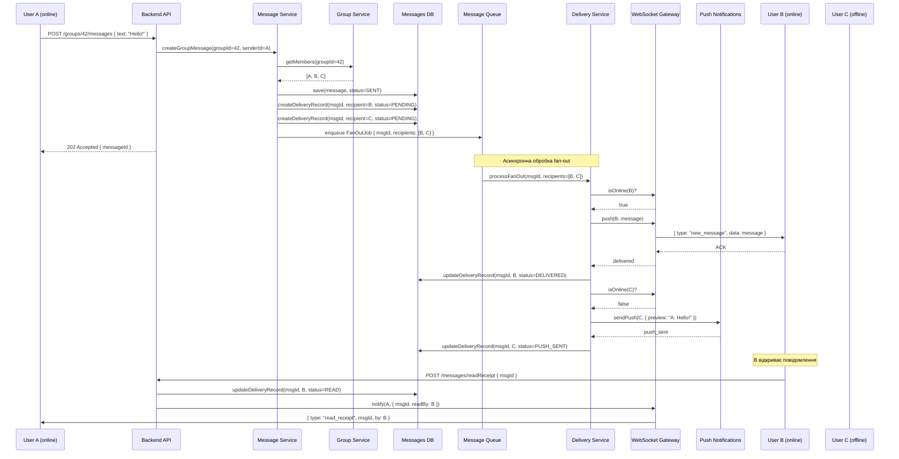
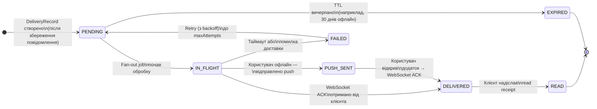

# Звіт з проектування системи: Варіант 4 — Груповий чат

Цей документ містить архітектурне проектування мінімальної системи обміну повідомленнями з фокусом на масштабування логіки доставки для групових чатів (віялове розсилання / fan-out). 

Система підтримує:
* Надсилання повідомлень між користувачами (включаючи групи);
* Асинхронну доставку;
* Індивідуальні статуси повідомлень для кожного отримувача (відправлено / доставлено / прочитано);
* Обробку користувачів, які перебувають офлайн.

---

## Частина 1 — Діаграма компонентів

Архітектура розділена на логічні блоки для чіткого розподілу відповідальності. Використовується черга повідомлень для асинхронного віялового розсилання (fan-out) та окремі сервіси для обробки онлайн (WebSocket) і офлайн (Push) клієнтів.



---

## Частина 2 — Діаграма послідовності

**Сценарій:** Користувач А надсилає повідомлення в групу, де Користувач B перебуває онлайн, а Користувач C — офлайн. 

Діаграма демонструє процес збереження повідомлення, генерації `DeliveryRecord` для кожного отримувача та асинхронну обробку розсилання через чергу.



---

## Частина 3 — Діаграма станів

Об'єктом для діаграми станів обрано не саме повідомлення загалом, а **DeliveryRecord** — запис про доставку конкретному отримувачу в межах групи. Це дозволяє відстежувати статус `read`/`delivered` індивідуально.



---

# Messenger System - Minimal Prototype (Lab 2)

## Опис проекту
Мінімальний прототип системи обміну повідомленнями (HTTP API), що демонструє базові практики розробки програмного забезпечення. Проект реалізовано мовою C# з використанням .NET 8 (Minimal APIs).

## Структура проекту
- `/MessengerApi/Models`: Моделі даних (`User`, `Conversation`, `Message`)
- `/MessengerApi/Storage`: Збереження даних у локальний JSON-файл (`database.json`)
- `/MessengerApi/Services`: Основна бізнес-логіка та валідація
- `/MessengerApi/Program.cs`: Налаштування веб-сервера, реєстрація залежностей (DI) та API-маршрути
- `/MessengerApi.Tests`: Автоматизовані інтеграційні тести (xUnit + WebApplicationFactory)
- `postman_collection.json`: Колекція готових запитів для ручного тестування API
- `nuget.config`: Локальна конфігурація для правильного завантаження пакетів .NET

## Реалізований функціонал
- **Користувачі:** Створення нових користувачів.
- **Бесіди:** Створення бесід (особисті або групові).
- **Повідомлення:** Відправка повідомлень та отримання повної історії листування.
- **Збереження даних (Persistence):** Стан зберігається між перезапусками програми у файлі `database.json`.
- **Обробка помилок:** Валідація порожніх полів та перевірка існування ID при відправці повідомлень.

## Вимоги до середовища
- [.NET 8.0 SDK](https://dotnet.microsoft.com/download/dotnet/8.0)

## Як запустити

1. Відкрийте термінал у кореневій папці проекту.
2. Перейдіть до папки основного API:
   ```bash
   cd MessengerApi
   ```
3. Запустіть сервер:
   ```bash
   dotnet run
   ```
   *Після запуску сервер повідомить локальну адресу та порт у консолі (наприклад, `http://localhost:5278`). Не закривайте термінал під час роботи з API.*

## Як тестувати

### 1. Автоматизовані тести (xUnit)
Проект містить інтеграційний тест, який автоматично підіймає сервер у пам'яті та перевіряє повний життєвий цикл повідомлення (створення користувача -> створення бесіди -> відправка повідомлення -> перевірка історії).
Для запуску тестів відкрийте новий термінал у кореневій папці та виконайте:
```bash
dotnet test
```

### 2. Ручне тестування (Postman)
1. Переконайтеся, що сервер запущено (`dotnet run`).
2. Відкрийте програму Postman та імпортуйте файл `postman_collection.json` (кнопка Import).
3. Переконайтеся, що порт у URL-адресах запитів співпадає з портом вашого запущеного сервера (за замовчуванням у колекції вказано `5278`).
4. Виконайте запити по черзі:
   - **1. Create User** (копіюйте згенерований `id` з відповіді)
   - **2. Create Conversation** (копіюйте `id` бесіди)
   - **3. Send Message** (вставте скопійовані `id` у вкладку Body)
   - **4. Get Messages** (вставте `id` бесіди в URL)

## Як запустити
1. Відкрийте термінал у кореневій папці проекту.
2. Перейдіть до папки основного API:
   ```bash
   cd MessengerApi
